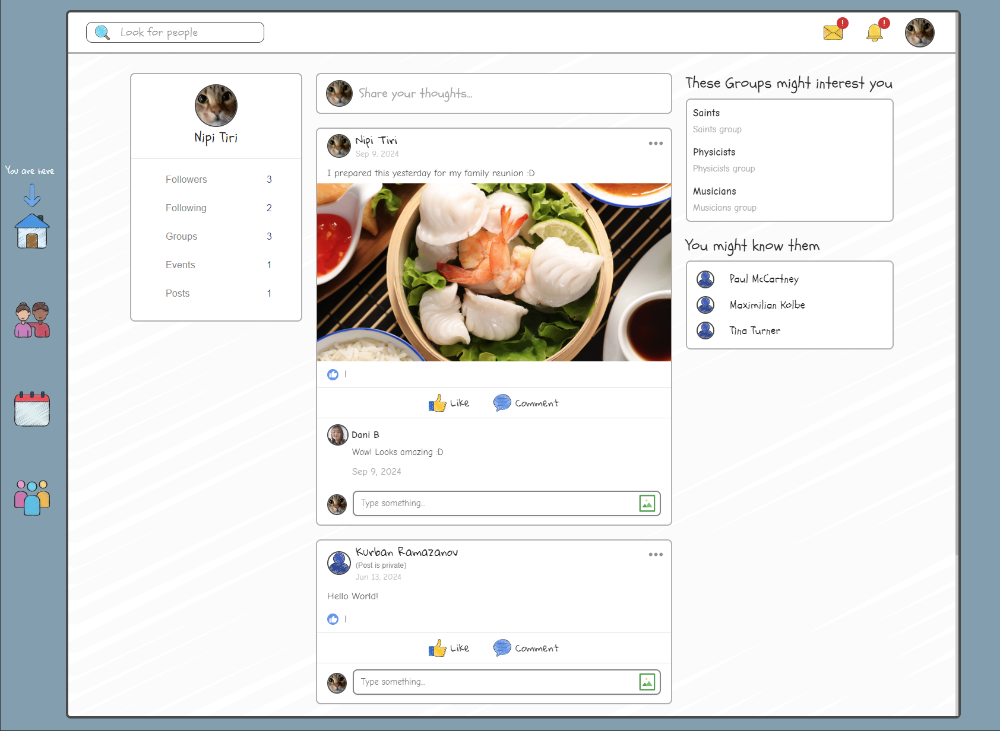
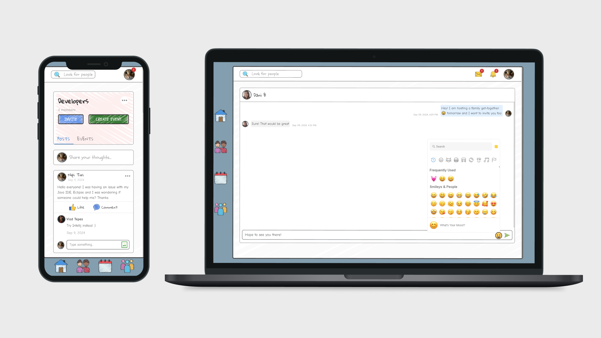

# SketchSphere network

This project is a Facebook-like social network built with Go (backend) and with Next.JS (frontend) to simulate a real-world social networking experience. It features user authentication with sessions and cookies.

The core functionalities include:
- **Followers:** Users can follow/unfollow each other with requests to follow private profiles.
- **Profiles:** Users can set their profile as public or private. Profiles showcase user activity, pictures, and followers.
- **Posts:** Users can create and interact with posts, including text and media, with privacy settings ranging from public to only followers.
- **Groups:** Users can create and join groups, post within them, and manage group events with attendance/RSVP options.
- **Chats:** Real-time private messaging and group chats powered by Websockets, including emoji support.
- **Notifications:** Users receive notifications for follow requests, group invitations, likes and comments.

We used SQLite for the database. The project uses Docker, with separate containers for the backend and frontend.

Project done by kramazan, tvooglai, aburnaz.

See project [description](https://github.com/01-edu/public/tree/master/subjects/social-network) and audit [requirements](https://github.com/01-edu/public/tree/master/subjects/social-network/audit).

Steps:
1. `git clone https://01.kood.tech/git/tvooglai/social-network.git`
2. `cd social-network`
3. `docker compose up`
4. Go to `http://localhost:3000`
5. Register or login to one of example accounts: `tom`, `kurb`, `nipi`, `dani`, `denzel`, `bruce`, `george`, `nick`, `alice`, `tina`, `janja`, `tanya`, `krystina`, `fedor`, `emily`, `emma`, `albert`, `richard`, `max`, `lee`, `vlad`, `maximilian`, `elisabeth`, `paul`. All have emails with pattern `<name>@kood.ee` and password `zaq12wsx`. All belong to some group. Defined groups are: `Developers`, `Climbers`, `Actors`, `Musicians`, `Physicists`, `Saints`, `Politicians`. But of course you can define your own.
6. Have fun.
7. To remove containers: `docker compose down`. To remove also images, use `docker compose down --rmi all -v`.

Frontend was developed from scratch by Kurban and helped by Daniela after she joined our team. Backend was adapted by Toomas from the previous work of @tammiktanar *et al*.
